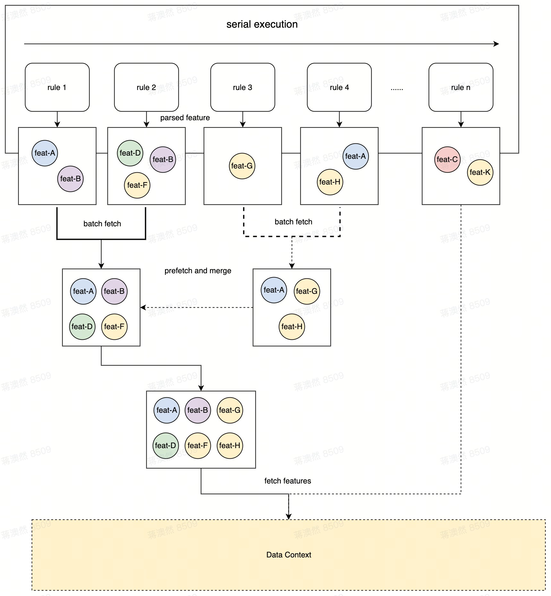

# Arishem实现网络数据访问

在规则判断的过程中，依赖网络数据的访问和判断是非常常见的，在arishem中，提供了Feature这种数据定义，他在运算的时候会进行回调，用户可以在自定义的网络数据获取模块加载数据。

## 使用FeatureExpr

在规则中，使用FeatureExpr来表示一个网络数据的访问，关键字为"FeatureExpr"，由FeaturePath和BuiltinParam(可选)构成，例如：

```json
 {
  "FeatureExpr": {
    "FeaturePath": "user.age"
  }
}
```

FeatureExpr支持内置参数(BuiltinParam)，内置参数表示的是Feature配置在规则中的一些固有参数，格式是Map格式的Expr，是在解析阶段可以计算出值的表达式，一般是常量或者规则右值的数据，如：

```json
{
  "FeatureExpr": {
    "FeaturePath": "user.age",
    // user is the feature name, age is the field path of user feature's data.
    "BuiltinParam": {
      "QueryIDRange": {
        "ConstList": [
          {
            "NumConst": 5678
          },
          {
            "NumConst": 1234
          }
        ]
      }
    }
  }
}
```

FeatureFetcher在被回调时，可以通过BuiltinParam()方法获取配置在规则中的内置参数，例如：

```go
func (m *MyFeatureFetcher) FetchFeature(feat typedef.FeatureParam, dc typedef.DataCtx) (typedef.MetaType, error) {
    builtinParam := feat.BuiltinParam()
    if builtinParam != nil {
        // handle builtin parameter
    } else {

    }
}
```

## 实现FeatureFetcher接口

在使用Feature时，必须在初始化arishem的时候，传入实现了FeatureFetcher的对象工厂方法，以供arishem在获取Feature时回调：

- 实现FeatureFetcher

你的FeatureFetcher必须实现Observable方法和FetchFeature方法。

```go
type MyFeatureFetcher struct {
	lock      sync.Mutex
	observers map[string]typedef.FeatureFetchObserver
}

func NewMyFeatureFetcher() *MyFeatureFetcher {
	return &MyFeatureFetcher{lock: sync.Mutex{}, observers: make(map[string]typedef.FeatureFetchObserver)}
}

func (m *MyFeatureFetcher) AddFetchObserver(v ...typedef.FeatureFetchObserver) {
	for _, observer := range v {
		m.observers[observer.HashCode()] = observer
	}
}

func (m *MyFeatureFetcher) GetFetchObservers() []typedef.FeatureFetchObserver {
	var obs []typedef.FeatureFetchObserver
	for _, observer := range m.observers {
		obs = append(obs, observer)
	}
	return obs
}

func (m *MyFeatureFetcher) ClearFetchObservers() {
	m.observers = make(map[string]typedef.FeatureFetchObserver)
}

func (m *MyFeatureFetcher) FetchFeature(feat typedef.FeatureParam, dc typedef.DataCtx) (typedef.MetaType, error) {
	// fetch feature here
	return nil, nil
}
```

- 初始化注册

在初始化arishem的时候，使用WithFeatureFetcherFactory传入你的工厂方法。

```go
func init() {
	Initialize(DefaultConfiguration(), WithFeatureFetcherFactory(func() typedef.FeatureFetcher {
		return NewMyFeatureFetcher()
	}))
}
```

## 其他API

在使用Feature的场景中，会出现依赖场景，如Feature-A依赖了Feature-B中的某一个或某几个字段作为入参数，那么可以在FetchFeature的回调方法中通过调用DataCtx的**GetFeatureValue**()方法获取某个Feature的字段，如Feature：payment_info依赖了Feature：user中的age信息：

```go
switch feat.FeatureName() {
	case "user":
		// get user info from network
	case "payment_info":
		age, _ := dc.GetFeatureValue(core.NewDefaultFeatureParamWithNoBuiltinParam("user"), "age")
  	// handle age here
	}
}
```

使用NewDefaultFeatureParamWithNoBuiltinParam可以创建一个没有内置参数的FeatureParam来获取某个feature的字段值。

每个FeatureParam实现了Hashable接口，HashCode是FeatureName和BuiltinParamHash的拼接，使用**GenBuiltinParamHash**和**DecodeFeatureHash**来获取FeatureParam的FeatureName和ParamHash，例如：

```go
func (m *MyObserver) OnFeaturesFetchStart(feat typedef.FeatureParam) {
  // get feature name and param hash
  featureName, paramHash := core.DecodeFeatureHash(feat.HashCode())
  // generate param hash
	paramHashhash = core.GenBuiltinParamHash(feat.BuiltinParam())
}
```

## 批次获取&预取优化

arishem在具有网络数据判断的规则场景做了非常多的性能优化，在具有优先级的规则判场景下，如果在每条规则判断时才去获取网络数据，那么规则判断的耗时大头占比就是命中规则前所有网络数据的请求耗时总和。
如果所有网络数据全部并发获取，则可能存在有些feature根本没用上，规则就已经命中返回了，而在无优先级的场景下，所有的feature并发获取则会给下游带来庞大的请求压力。

所以arishem在执行时，会按照规则数量进行分批计算，每一批规则计算的时候，会将依赖的feature去重，再并发获取，并且arishem默认开启了预取，即在执行当前批次规则时，会提前预取下一个批次的feature，即使当前批次的规则执行完毕也能立即返回，不影响原来的规则执行效率。



在arishem的feature测试中，同时运行5条具有优先级的规则和3条不具有优先级的规则，总共依赖了user和payment两个feature，并且user分别存在一个带有BuiltinParam和一个不带有BuiltinParam的Feature，payment依赖了不带BuiltinParam的user的age字段做额外的判断，在模拟网络请求中，带有BuiltinParam的user耗时100ms，而不带有BuiltinParam耗时200ms，payment本身耗时150ms，如下：

```go
func (m *MyFeatureFetcher) FetchFeature(feat typedef.FeatureParam, dc typedef.DataCtx) (typedef.MetaType, error) {
	switch feat.FeatureName() {
	case "user":
		if feat.BuiltinParam() != nil {
			time.Sleep(100 * time.Millisecond)
			if feat.BuiltinParam()["user_id"] != uint64(100) {
				panic("error param")
			}
			name, _ := dc.GetVarValue([]string{"user1", "name"})
			age, _ := dc.GetVarValue([]string{"user1", "age"})
			return map[string]interface{}{"name": name, "age": age}, nil
		} else {
			time.Sleep(200 * time.Millisecond)
			name, _ := dc.GetVarValue([]string{"user2", "name"})
			age, _ := dc.GetVarValue([]string{"user2", "age"})
			return map[string]interface{}{"name": name, "age": age}, nil
		}
	case "payment_info":
		time.Sleep(150 * time.Millisecond)
		age, _ := dc.GetFeatureValue(core.NewDefaultFeatureParamWithNoBuiltinParam("user"), "age")
		rate, _ := dc.GetVarValue([]string{"rate#2"})
		return map[string]interface{}{"account": float64(age.(int64)) * rate.(float64)}, nil
	}
	return nil, nil
}
```

5条带有优先级和3条不具有优先级的规则都至少依赖了一个feature，在测试case中，执行这8条规则的总耗时大约在200ms左右：

```shell
feature=>user$$17237948788471647225 end, cost time=>102.268155ms
feature=>user$$7232629218895650627 end, cost time=>200.728951ms

rule:np-rule3 judge node passed: false, left(Jane) == right(John)
rule:np-rule1 judge node passed: false, left(Jane) == right(1)

feature=>payment_info$$7232629218895650627 end, cost time=>201.327525ms

rule:p-rule1 judge node passed: false, left(90) < right(90)
rule:p-rule2 judge node passed: false, left(90) LIST_IN right([10 98 101 -1120])
rule:np-rule2 judge node passed: true, left(90) == right(90)
rule:p-rule3 judge node passed: false, left(18) == right(24)
rule:p-rule4 judge node passed: false, left(John) > right(John)
rule:p-rule5 judge node passed: true, left(Jane) > right(Jack)

arishem_rule_execute_feature_test.go:354: execute rules total cost=>201.509082ms
```

